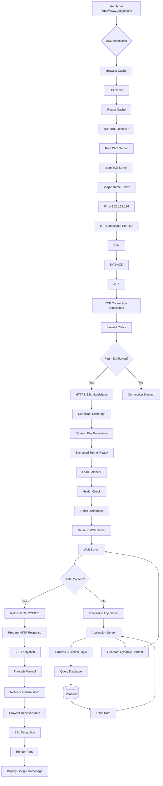

# What Happens When You Type https://www.google.com in Your Browser and Press Enter?
## The Complete Journey - Request Flow Diagram :

```mermaid
graph TD
    A[User Types https://www.google.com] --> B{DNS Resolution}
    B --> C[Browser Cache]
    C --> D[OS Cache]
    D --> E[Router Cache]
    E --> F[ISP DNS Resolver]
    F --> G[Root DNS Server]
    G --> H[.com TLD Server]
    H --> I[Google Name Server]
    I --> J[IP: 142.251.32.196]
    
    J --> K[TCP Handshake Port 443]
    K --> L[SYN]
    L --> M[SYN-ACK]
    M --> N[ACK]
    N --> O[TCP Connection Established]
    
    O --> P[Firewall Check]
    P --> Q{Port 443 Allowed?}
    Q -->|Yes| R[HTTPS/SSL Handshake]
    Q -->|No| S[Connection Blocked]
    
    R --> T[Certificate Exchange]
    T --> U[Session Key Generation]
    U --> V[Encrypted Tunnel Ready]
    
    V --> W[Load Balancer]
    W --> X[Health Check]
    X --> Y[Traffic Distribution]
    Y --> Z[Route to Web Server]
    
    Z --> AA[Web Server]
    AA --> AB{Static Content?}
    AB -->|Yes| AC[Return HTML/CSS/JS]
    AB -->|No| AD[Forward to App Server]
    
    AD --> AE[Application Server]
    AE --> AF[Process Business Logic]
    AF --> AG[Query Database]
    
    AG --> AH[(Database)]
    AH --> AI[Fetch Data]
    AI --> AE
    
    AE --> AJ[Generate Dynamic Content]
    AJ --> AA
    AC --> AK[Prepare HTTP Response]
    
    AK --> AL[SSL Encryption]
    AL --> AM[Through Firewall]
    AM --> AN[Network Transmission]
    
    AN --> AO[Browser Receives Data]
    AO --> AP[SSL Decryption]
    AP --> AQ[Render Page]
    AQ --> AR[Display Google Homepage]
```
